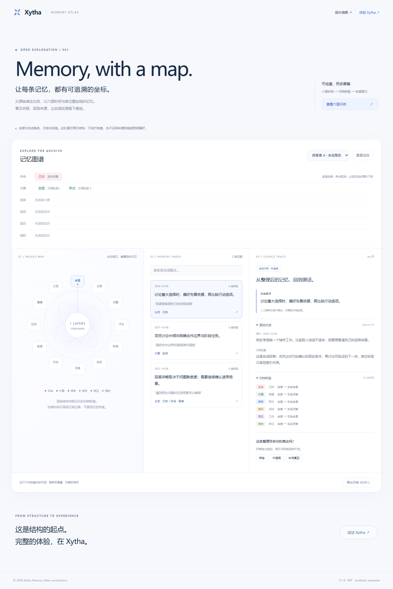

<p align="center"></p>
<h1 align="center">Xytha Memory Atlas</h1>
<p align="center"><b>让每条记忆，都有可追溯的坐标。</b><br/>Six time layers. Archived labels. Traceable sources.</p>
<h2 align="center"><a href="https://xytha.com">体验完整 Xytha → https://xytha.com</a></h2>
<p align="center">在线对话 · 个性化记忆 · 命盘探索</p>
<p align="center"><a href="README.en.md">English</a> · <a href="docs/architecture.md">设计说明</a> · <a href="docs/scope.md">开源范围</a> · <a href="docs/website-changelog.md">网站更新记录</a></p>



**Xytha Memory Atlas 是一个可独立运行的开源记忆检查工具。** 它将原始对话、压缩概述、六层时间标签与宫位关联放在同一视图中，让人可以检查“这条记忆从哪里来、当时怎样归档、后来怎样被更正”。

所有示例均为人工编写的合成数据。这里展示结构与交互，不包含真实生辰，不调用模型，不执行排盘，也不证明命理标签能够预测人格或偏好。

## 30 秒开始

需要 Node.js 22 或更新版本。下载并解压仓库后，在目录内运行：

```sh
npm run dev
```

打开 **http://127.0.0.1:4173**。没有运行时依赖，无需 `npm install`、API Key 或注册。Windows PowerShell 若阻止 npm 脚本，可运行 `npm.cmd run dev`。

先点 **「查看六层示例」**，再尝试：

1. 查看命迁线上的六层归档标签，对照右侧原始对话与概述。
2. 点击另一个大限，观察流年及以下选择同时清空；再点同一按钮可取消。
3. 点击宫位，筛选归档到该宫位的记忆。
4. 在某条记忆下补充更正，确认原文和原始标签仍然保留。
5. 切换合成角色，或导出 JSON 检查记录关系。

演示反馈仅保存在当前页面内存中，刷新即重置。导出文件包含主动填写的反馈，请勿填写真实隐私信息。

## 这个项目想展示什么

普通的摘要列表难以回答：一条偏好是从哪次表达得来的？它适用于哪类场景？后来的更正有没有覆盖原话？

Xytha 的探索是：为每条记忆保留**归档当时的结构化上下文**，将本命、大限、流年、流月、流日、流时作为分层标签，与明确的来源和后续反馈相连接。用户可以沿这些坐标检查记录，而不必只相信一段生成的概述。

本开源版本提供的是这套思路的**公开检查层与可复用格式**。正式版的调度、偏好评分、个性化筛选和模型上下文装配没有包含在内。

| 已提供 | 具体行为 |
| --- | --- |
| 六层时间树 | 父子约束、直接点击、再次取消、下级联动清空 |
| 宫位关联图 | 展示归档标签；点击宫位执行精确筛选 |
| 来源追溯 | 对话原文、引用片段、概述与来源 ID 对照 |
| 反馈事件 | 追加确认、不适用或更正，不覆写历史记录 |
| 数据契约 | JSON Schema、运行时验证器、合成数据与单元测试 |
| 独立演示 | 无运行时依赖，纯静态站点，无后台服务 |

## 用在自己的项目中

```js
import {freshDemo} from './data/demo.mjs';
import {filterMemories, traceMemory} from './src/memory.mjs';

const archive = freshDemo();
const matches = filterMemories(archive, {
  profileId: 'sample-a',
  selection: {yearly: 'sample-a-y1'},
  palace: '迁移'
});
const evidence = traceMemory(archive, matches[0].id, 'sample-a');
console.log(evidence.record.summary, evidence.source.question);
```

`filterMemories` 只做显式标签与文本匹配，**没有偏好推断或相关性评分**。修改成其他领域的分类标签，也可以用于项目复盘、阅读记录和个人知识归档。具体业务中的身份鉴别、存储、授权与数据迁移需要自行实现。

## 数据与研究边界

- 原始表达是来源证据；概述是整理结果；宫位标签是文化分类元数据。三者不可混为事实。
- 示例干支与时间区间是演示用映射；区间采用 UTC 与左闭右开约定，不是传统历法换算结果。
- 本仓库不报告命中率、提升比例或用户实验结果。它没有提供真实用户研究。
- 宫位标签能否改善偏好召回，仍是需要检验的假设。可行的对照与反证路径见 [评估计划](docs/evaluation.md)。

## 开发与部署

```sh
npm test
npm run check
npm run build
```

`dist/` 是可部署到静态托管服务的输出目录，支持子路径部署。检查脚本采用公开文件允许列表，并拒绝常见密钥模式与部署内部字段；它不能替代人工审阅。详见 [发布指南](docs/publishing.md)。

```text
src/       标签检查、筛选、追加反馈、交互视图
data/      合成角色、合成对话与合成标签
schemas/   JSON Schema
tests/     时间联动、归属隔离、来源约束与更正测试
docs/      架构、研究边界、范围与发布材料
```

欢迎贡献更清楚的可视化、无障碍交互、数据验证或新的合成用例。先阅读 [贡献说明](CONTRIBUTING.md)。

## 与 Xytha 的关系

这个仓库展示可检查的记忆结构。完整的对话与记忆体验见 **[xytha.com](https://xytha.com)**。本仓库的页面内存演示与在线产品的设备本地保存是两个不同实现。

代码与本仓库原创示例采用 [MIT License](LICENSE)。Xytha 名称不表示衍生项目获得官方背书。
