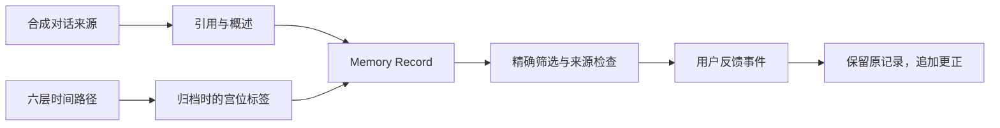

# 从原始表达，到可检查的记忆

这里将 Xytha 的记忆思想整理为一个公开、可独立验证的数据模型。



## 三类内容分别保存

`sources` 保存不可被反馈覆写的对话原文。`records` 引用一个来源，保存引用片段、概述和归档时的六层标签。`feedback` 追加确认、不适用或更正事件。

本仓库的“不可覆写”指所提供的反馈函数不修改旧对象，不代表密码学不可篡改。导出的 JSON 可以由持有者自行编辑；没有数字签名或审计服务器。

## 六层时间与标签

```text
本命 natal
  └ 大限 decadal
     └ 流年 yearly
        └ 流月 monthly
           └ 流日 daily
              └ 流时 hourly
```

时间树中的每个节点属于一个角色；每条记录的六个标签必须连接成同一父子路径。`palace` 表示当前层的宫位名，`anchorPalace` 表示映射到的本命宫位。多层标签映射到同一条轴线时，界面显示相应的聚合关系。

例：一条合成记录的六个标签分别映射到本命命宫或迁移，公开检查层可以显示“六层标签位于命迁线”。这只陈述已记录的标签结构，不能得出“用户必然喜欢某类回答”。

更换时间筛选不会按照新时间重算旧记录的标签。缺少上级时不能直接选下级；重选上级会清空其下所有选择。

## 公开接口

| 接口 | 作用 |
| --- | --- |
| `validateArchive` | 验证合成格式、父子范围、来源归属、引用原文、六层路径与反馈 |
| `selectPeriod` | 计算明确点击后的时间选择状态 |
| `optionsFor` | 返回已选上级的直接子节点 |
| `filterMemories` | 按角色、明确时间 ID、宫位和文本筛选 |
| `traceMemory` | 获取记录及同角色的来源和反馈 |
| `sharedAxes` | 描述标签位于哪些相对宫位轴线 |
| `appendFeedback` | 追加事件，保持来源与归档标签不变 |

这些函数不构成权限系统。浏览器内已经包含全部合成角色数据，角色切换只是视图隔离。真实多用户系统需要服务端授权、访问控制与安全存储。

## 可复用与保留部分

开放可检查的数据结构，有利于讨论如何组织、展示和修正记忆。正式产品中的个性化评分、调度、模型提示、选择策略与上线配置不在本仓库内。这里没有伪装成生产算法的简化评分公式。
